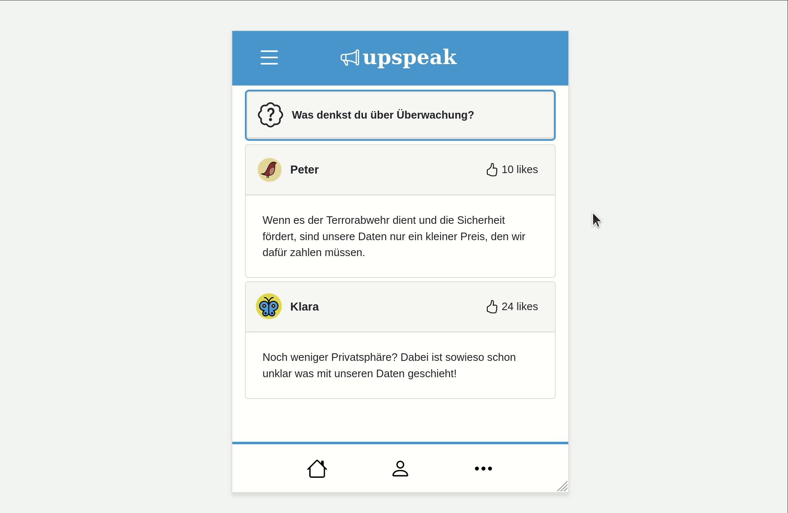
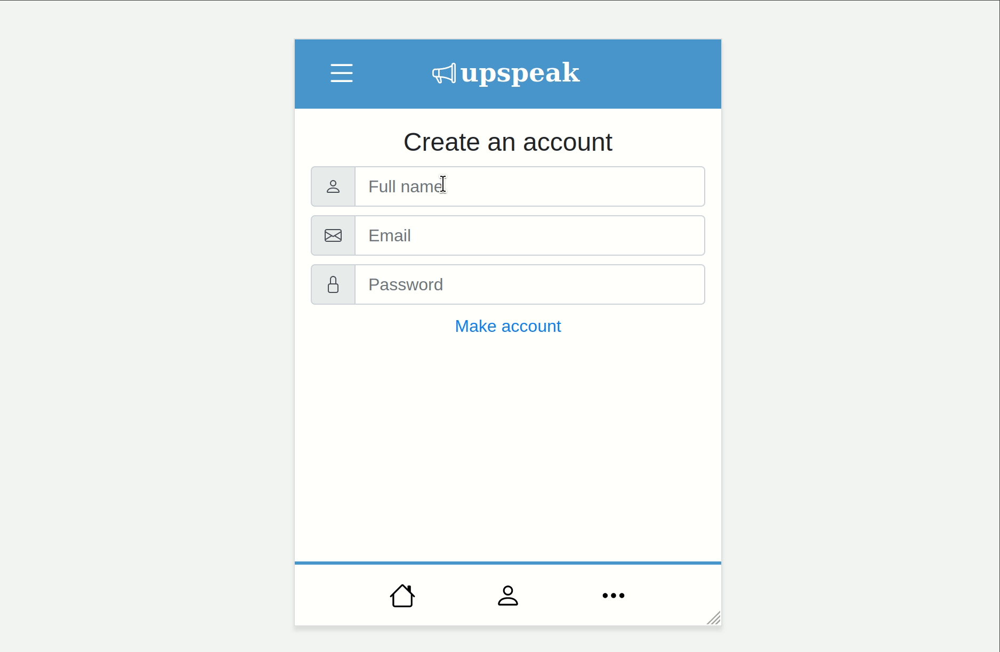
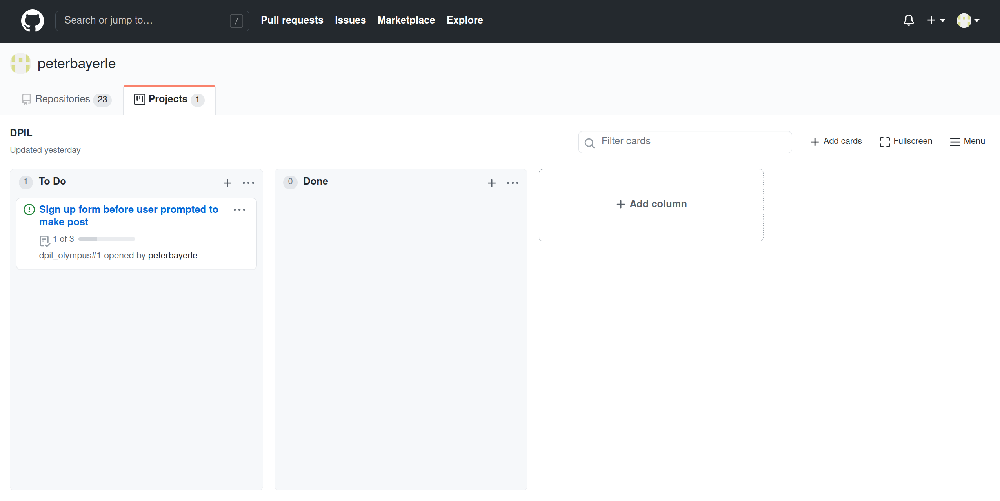

# 3-19-21 update

## Update 1: only two posts show up at a time in ephemeral version
Now, the ephemeral app only shows 2 posts at a time. This means the user is unable to scroll down, forcing them to see the posts disappear/appear on screen:

To achieve this I had to alter the post timeline. Now, posts appear every 5 seconds, and disappear after 10 seconds.

## Update 2: sign up -> compose flow
I also made some progress on the sign up form. In the survey, we'll present the participant with the sign up form that will immediately redirect them to the composition view:

There are some problems with this form. I have to add validation so the user must fill out every field before pressing "make account." I also have not yet replaced the "You" in the user post with the name they entered in the form. After these two changes I think this sign up -> compose flow will be ready to go!

## Update 3: organizational changes
I decided to convert the single Olympus repository into two: one to hold the code, one to hold the documentation. I'm also making use of GitHub's [issues/Kanban board](https://github.com/users/peterbayerle/projects/1) feature to keep track of what changes need to be made to the app:

If you guys want to make suggestions the best way would be to add to the to-do column on the board.