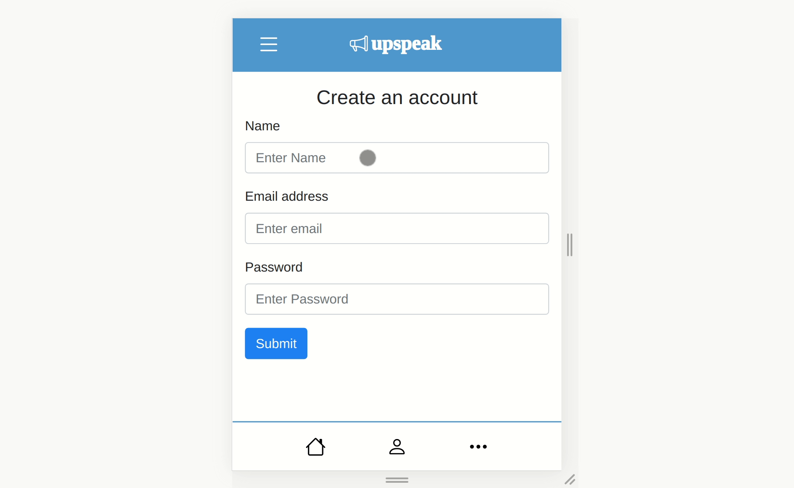
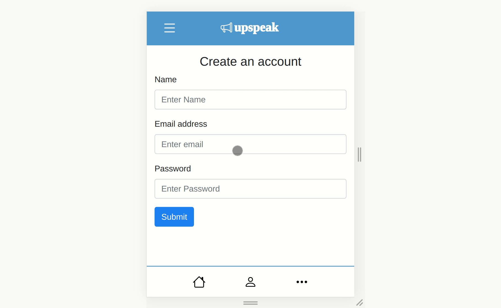

# 4-2-21 update

## Update: Completed sign up -> compose flow
The participant is first provided with a sign up form that asks for their name, email, and password. Only the name is stored, and used in the compose view after they make a post:

I also implemented form validation so if an invalid name/email/password is inputted, the user is prompted to provid valid inputs:

